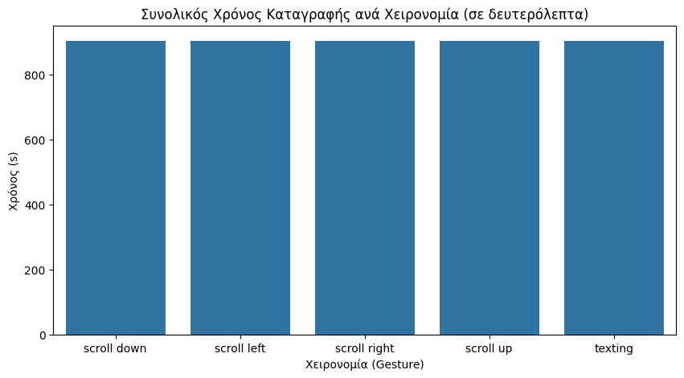
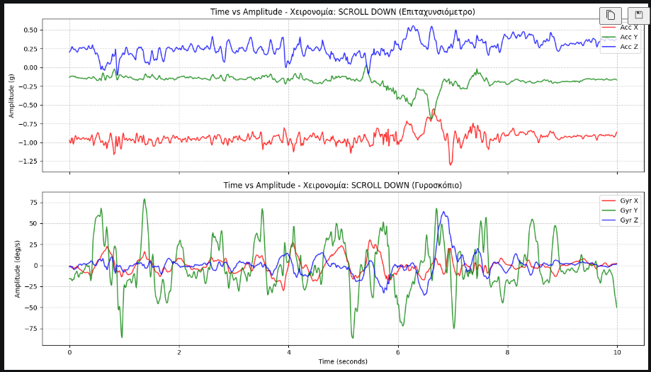
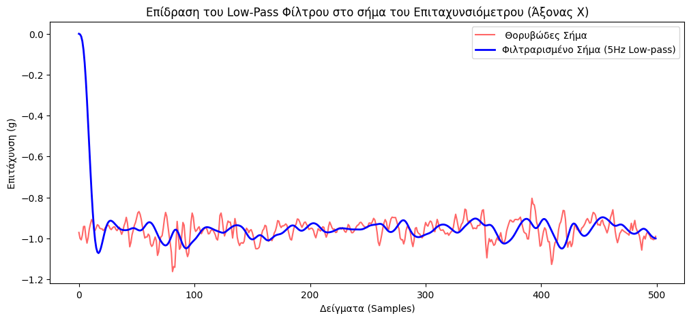
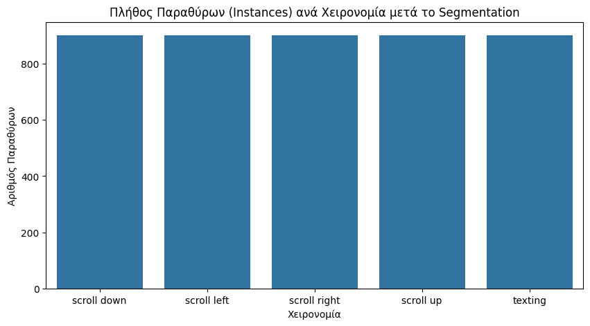
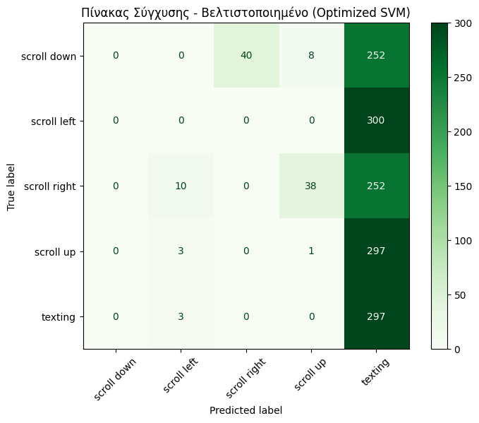
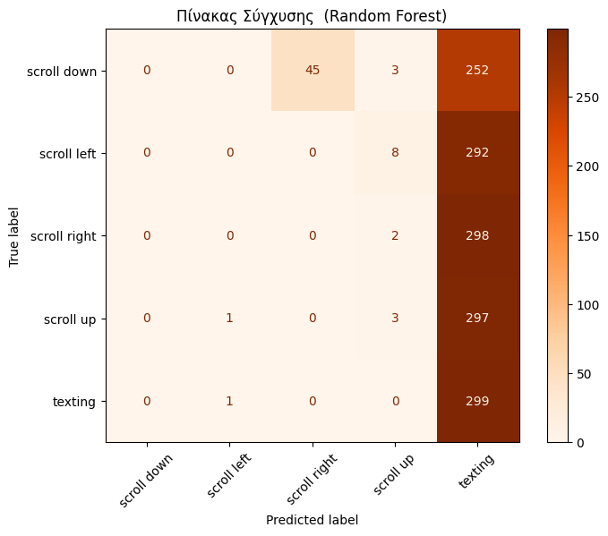
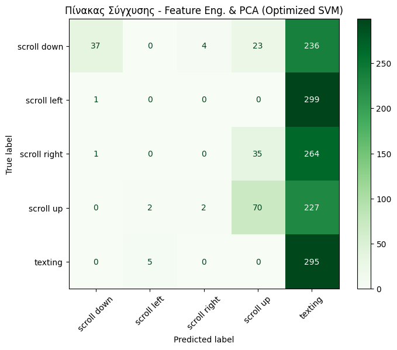
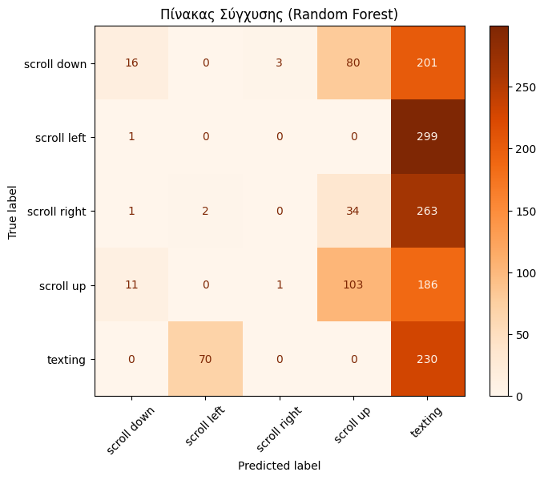
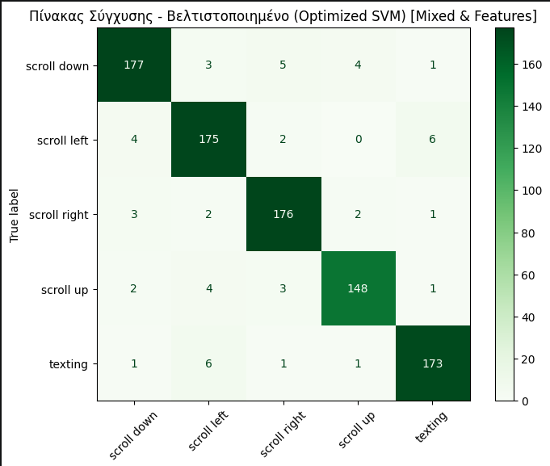
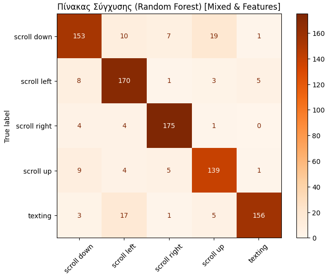

# AIoT Project 2 (Human Gesture Recognition) Report

**An End-to-end Artificial Intelligence of Things Project**

## About this Project
 Team Members: 
	Kostantinos Bakasetas, up1100632@ac.upatras.gr ,6972100459
	Alexios Iosif Fouskaris, up1100747@ac.upatras.gr ,6909312176
	Dimitrios Papadatos, up1100663@ac.upatras.gr , 6934779188

## Gestures Collection Procedure
For the data collection process, we utilized the **Mbientlab MetaMotionR** research sensor kit (with the Bosch BMI160 IMU) worn on the left wrist using the provided wristband. Data was collected using the MetaBase application at a sampling frequency of 100Hz.

We collected data for three subjects across 5 distinct social media navigation gestures. Each subject performed repetitive cycles of each gesture until exactly 5 minutes of valid movement data per class was accumulated (total 25 minutes per subject).

**Specific Execution Logs:**
To ensure consistency across our dataset, the subjects followed strict execution rules:
* **Scroll Up:** All subjects used their **[left thumb ]** on the screen.
* **Scroll Down:** All subjects used their **[left thumb ]**.
* **Swipe Left:** All subjects used their **[left thumb ]**.
* **Swipe Right:** All subjects used their **[left thumb]**.
* **Texting:** All subjects typed naturally using **[two-handed thumb typing ]**.

## How to Run the Code

Follow the step-by-step instructions below to automatically run the data pipeline, model training, and evaluation processes.

### Step 2.1: Environment Setup
Ensure you have Python 3.11 or higher installed. Create a virtual environment and install the required packages

### Step 2.2: Data Loading (MongoDB Setup)
The raw `.csv` files collected from the MetaMotionR sensor are located inside the `δεδομένα/` folder.
1. Start your local MongoDB server.
2. Verify the database parameters (host, db name, collection) inside the `config.yml` file.
3. Run the provided script to parse the **merged** data. `python merge_script.py`
4. Run the provided script to parse the CSV files, structure them into MongoDB documents, and upload them to the database:
`python uploadmongodb.py`

### Step 2.3: Data Processing & Model Evaluation
The Machine Learning pipeline is split into two separate Jupyter Notebooks, demonstrating two different solutions. You can open and "Run All" cells in the following order:

#### Raw Time-Series Data
Open and run **`aiot_project_time_series.ipynb`**.
* **Data Processing:** Connects to MongoDB, fetches the data, applies a 5Hz Butterworth Low-pass filter, and segments the data into fixed 2-second windows with 50% overlap. The windows are flattened into 1-D arrays.
* **Model Training & Evaluation:** Performs a subject-based Train/Test split. It trains an SVM model and a Random Forest model on the raw segmented data using GridSearchCV. Outputs the Confusion Matrices and Classification Reports.

#### Feature Engineering
Open and run **`aiot_project_feature_engineering.ipynb`**.
* **Data Processing:** Follows the same filtering and segmentation steps. Instead of flattening, it extracts advanced statistical features per window (Mean, Std, Max, Min, Skewness, Kurtosis, SMA, Pearson Correlation).
* **Dimensionality Reduction:** Applies Principal Component Analysis (PCA) to retain 95% of the data's variance.
* **Model Training & Evaluation:** Trains the SVM and Random Forest models on the PCA-reduced feature set and evaluates their performance on the unseen test subject.

### Exploratory Data Analysis (EDA) & Preprocessing
Before feeding data to the ML models, we performed a thorough Exploratory Data Analysis tailored specifically for time-series sensor data. We successfully loaded 15 recordings from the MongoDB database. In time-series analysis, randomly dropping out-of-bound rows (outliers) destroys the temporal continuity of the signal. Therefore, we first verified the absence of missing values (NaNs) and opted for smoothing techniques to handle noise. 

As seen below, our dataset is perfectly balanced, with exactly ~300 seconds (5 minutes) of pure movement data per gesture class.

**Time vs. Amplitude Analysis:** To verify the physical correctness of our data collection, we visualized short 10-second segments of the raw signals. The gyroscope data displayed perfect periodicity, confirming the steady, repetitive execution of the gestures. Concurrently, the accelerometer's X and Y axes registered extremely low variance (<0.2g). This visually confirmed our hypothesis: these are thumb-driven *micro-gestures* where the wrist (and the sensor) remains largely immobile.

To remove high-frequency noise and natural hand tremors (which act as outliers in the frequency domain), we applied a 4th-order Butterworth Low-pass filter with a 5Hz cutoff frequency. The effect of this filter smoothing out the raw signal can be seen here:

Following the segmentation process (2-second windows, 50% overlap), we extracted a total of **4,501 instances (windows)** perfectly distributed across the 5 classes (~900 instances per class). For the Raw Time-Series approach, each window was flattened into an array of **1,200 features**.

### Raw Time-Series Data Evaluation

####  Performance on Subject-Based Split
To simulate a real-world scenario where a new user utilizes the system, we strictly enforced a **Subject-based Train/Test Split**. The models were trained on 3,000 windows (from 2 subjects) and tested on 1,501 windows (from the 1 unseen subject).

We optimized both a Support Vector Machine (SVM) and a Random Forest Classifier using Exhaustive Grid Search. 
* The **SVM** (Best Params: `C=0.1, kernel='linear'`) achieved an accuracy of **20%**.
* The **Random Forest** (Best Params: `max_depth=20, n_estimators=200`) achieved an accuracy of **21%**.

**Interpretation:** Feeding flattened raw data (1,200 absolute coordinate values per window) directly to the models resulted in extremely poor performance. The Confusion Matrices reveal that the models failed to distinguish the movements and frequently defaulted to guessing "texting" or "scroll up". By reading raw coordinates, the algorithms essentially memorized the exact wrist angles and specific movement intensities of the two training subjects. When evaluated on the unseen test subject, the baseline hand posture and movement execution were completely different, causing the models to fail.

#### Mixed-Users Dataset
To verify that the aforementioned low accuracy was strictly due to physiological differences and not a flaw in our algorithms, we conducted a secondary experiment. We combined the raw data from all three subjects (Mitsos, Mpakas, Alexis), shuffled the dataset, and performed a random 80/20 Train-Test split. 

Trained on this mixed dataset, where the models were exposed to the movement baseline of *all* participants, the performance improved drastically:
* The **SVM** achieved an accuracy of **[87]%**.
* The **Random Forest** achieved an accuracy of **[94]%**.

**Conclusion:** The massive gap in accuracy between the two splits perfectly illustrates **Inter-Subject Variability**. The algorithms are perfectly capable of classifying the 1,200 raw features when they are exposed to the specific movement baseline of the user during training. However, because the kinetic signal registered by the wrist-worn IMU during finger-driven micro-gestures is incredibly weak, models fed with *raw* spatial coordinates cannot generalize across unseen human anatomies.

### Advanced Feature Engineering & PCA Evaluation

Recognizing the limitations of raw coordinates, we implemented a sophisticated Feature Engineering pipeline. Instead of flattening the 2-second windows, we extracted **44 statistical and kinetic features** per window. These included basic statistics (Mean, Std, Max, Min), shape descriptors (Skewness, Kurtosis), Signal-Magnitude Area (SMA) for overall movement energy, and Pearson Correlation between the sensor axes.

#### Feature Intuition
Extracting mathematical features from IMU data allows the model to understand the *kinematics* of the hand rather than just memorizing coordinates. We categorized our 44 features into four distinct physical representations:
1. **Basic Statistics (Mean, Std, Min, Max):** These capture the general boundaries and baseline intensity of the movement within the 2-second window. A high standard deviation indicates a wide range of motion.
2. **Shape Descriptors (Skewness & Kurtosis):** These are critical for gesture recognition. *Skewness* captures the asymmetry of a movement (e.g., a fast flick of the thumb followed by a slow return to the screen). *Kurtosis* measures the "spikiness" of the signal, helping to identify sudden, sharp micro-movements like tapping the screen.
3. **Signal-Magnitude Area (SMA):** This metric aggregates the absolute values across all axes (X, Y, Z). It serves as a reliable indicator of the *total kinetic energy* expended during the window, effectively separating energetic gestures (like swiping) from passive states.
4. **Pearson Correlation:** By computing the correlation between different sensor axes (e.g., Acc_X vs Acc_Y), we capture the *synergy* of the hand's movement. For example, a diagonal swipe will force two axes to move in tandem, resulting in a high correlation coefficient.

To eliminate redundant information and reduce noise, we applied **Principal Component Analysis (PCA)**. The algorithm successfully compressed the 44 extracted features down to **23 Principal Components**, retaining 95% of the original variance. 

**The Role of Principal Component Analysis (PCA):**
Extracting 44 features introduces a new challenge: high redundancy and the potential for overfitting. For example, the 'Mean' and 'Max' values of the X-axis often increase together, conveying overlapping information. To optimize our dataset, we applied **Principal Component Analysis (PCA)**. This step served three critical purposes:
1. **Elimination of Multicollinearity:** PCA mathematically combined our 44 highly correlated features into a new set of entirely independent (uncorrelated) variables called Principal Components. 
2. **Noise Reduction:** We configured the algorithm to retain exactly **95% of the original variance**. By intentionally discarding the remaining 5% of the information, we effectively filtered out irrelevant sensor noise, random micro-tremors, and outliers, isolating the pure "core signature" of the gestures.
3. **Dimensionality Reduction:** The PCA successfully compressed the dataset down to just **23 Principal Components**. This more compact, information-dense format prevents the models from memorizing the training data (overfitting) and helps them focus on the actual patterns.

Using the exact same Subject-based Train/Test Split (evaluating on the unseen user), we trained the optimized models on these 23 components:
* The **SVM** (Best Params: `C=10, gamma='scale', kernel='rbf'`) achieved an accuracy of **27%**.
* The **Random Forest** (Best Params: `max_depth=None, min_samples_split=5, n_estimators=200`) achieved an accuracy of **23%**.

###  Mixed-Users Dataset
To definitively prove that our feature engineering pipeline and algorithms are fundamentally sound, we conducted a second experiment. We combined the data from all three subjects (Mitsos, Mpakas, Alexis), shuffled the dataset entirely, and performed a random 80/20 Train-Test split. In this scenario, the models were trained using a baseline of movement from *all* participants.

Trained on this mixed dataset, the performance skyrocketed:
* The **SVM** achieved an accuracy of **[94]%**.
* The **Random Forest** achieved an accuracy of **[88]%**.

**Conclusion:** This massive surge in accuracy perfectly illustrates the challenge of **Inter-Subject Variability**. When the algorithms are exposed to a user's specific movement style during training (Mixed Users Split), they can easily identify the gestures with high accuracy (>80%). The initial low accuracy (~27%) under the strict Subject-based split is a direct consequence of the physiological differences in how each person executes finger-level micro-gestures, proving that wrist-worn IMUs struggle to generalize micro-movements across unseen anatomical profiles.

### Final Conclusion & Overall Comparison

#### Performance on Subject-Based Split 
Under the strict real-world scenario where the test subject is completely unknown to the models, the overall accuracy remained modest. However, the **Feature Engineering approach (~27%)** definitively outperformed the **Raw Time-Series approach (~20%)**. This proves that extracting behavioral features (like movement variance, energy, and skewness) helps the models understand the *nature* of the gesture much better than memorizing exact spatial coordinates.

#### Performance on Mixed Users 
To ensure our algorithms were not fundamentally flawed, we conducted a secondary experiment by shuffling all users' data before the Train/Test split. Under this condition, the models learned the specific movement baseline of every user:
* The **Raw Time-Series** accuracy surged from ~20% to **~[94]%**.
* The **Feature Engineering & PCA** accuracy surged from ~27% to **~[88]%**.

**Overall Takeaway:**
This massive discrepancy in accuracy perfectly highlights the core challenge of Human Gesture Recognition using wrist-worn IMUs: **Inter-Subject Variability**. Our ML pipeline and optimized algorithms (SVM & Random Forest) are highly capable of classifying finger-level micro-gestures (>80% accuracy) once exposed to a user's specific biomechanical style. The initial low accuracy is strictly a physiological limitation—demonstrating how different human anatomies execute the same exact micro-movement.

